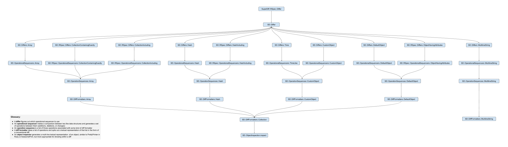

# Architecture

I'll have more later around this,
but here are some quick hits:

## Basic concepts

- An **object inspector** generates a multi-line textual representation of an object,
  similar to PrettyPrinter in Ruby or AwesomePrint,
  but more appropriate for showing within a diff.
- An **operation** represents a difference in one value from another
  in the context of a data structure.
  That difference can either be an _delete_, _insert_, or _change_.
- An **operation tree** is the set of all operations between two data structures,
  where each operation represents the difference between an inner element within the structure
  (value for an array or a key/value pair for a hash).
  Since change operations represent elements that have child elements,
  they also have child operations to represent those child elements.
  Those child operations can themselves have children, etc.
  This descendancy is what forms the tree.
- An **operation tree builder** makes a comparison between two like data structures
  and generates an operation tree to represent the differences.
- A **diff formatter** takes an operation tree
  and spits out a textual representation of that tree in the form of a conventional diff.
  Each operation may in fact generate more than one line in the final diff
  because the object that is specific to the operation is run through an object inspector.
- Finally, a **differ** ties everything together
  and figures out which operation tree builder and diff formatter to use for a particular pair of values
  (where one value is the "expected" and the other is the "actual").

## Code flow diagram

