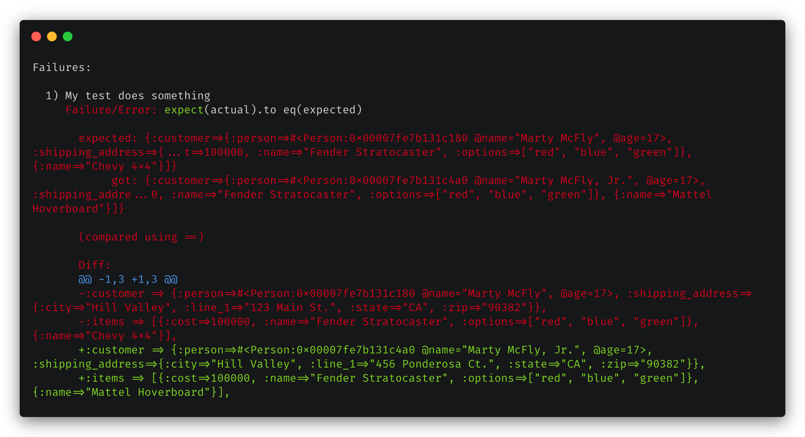
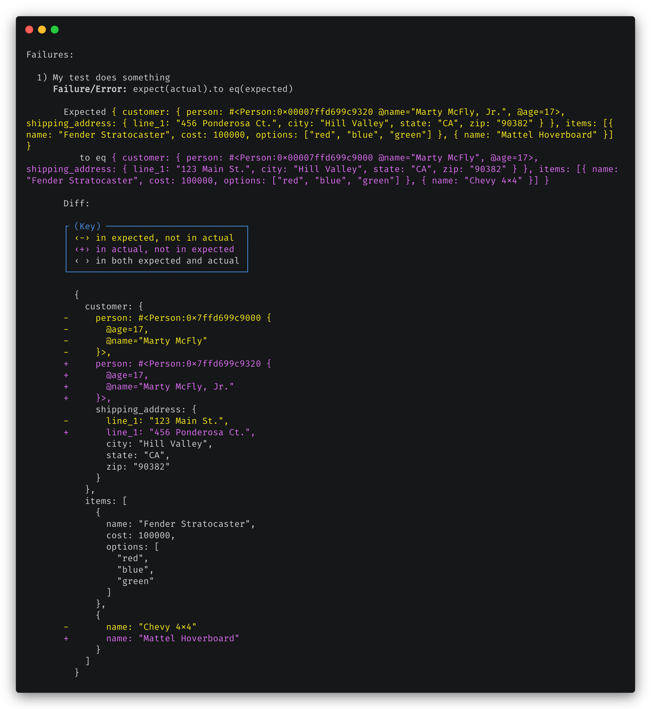

# SuperDiff [![Gem Version][version-badge]][rubygems] [![Build Status][gh-actions-badge]][gh-actions] ![Downloads][downloads-badge]

[version-badge]: http://img.shields.io/gem/v/super_diff.svg
[rubygems]: http://rubygems.org/gems/super_diff
[gh-actions-badge]: https://img.shields.io/github/actions/workflow/status/splitwise/super_diff/super_diff.yml?branch=main
[downloads-badge]: http://img.shields.io/gem/dtv/super_diff.svg
[hound]: https://houndci.com

**SuperDiff** is a Ruby gem
which is designed to display the differences between two objects of any type
in a familiar and intelligent fashion.

📢 **[See what's changed in recent versions.][changelog]**

[changelog]: ./CHANGELOG.md

## Introduction

The primary motivation behind this gem
is to vastly improve upon RSpec's built-in diffing capabilities.
RSpec has many nice features,
and one of them is that whenever you use a matcher such as `eq`, `match`, `include`, or `have_attributes`,
you will get a diff of the two data structures you are trying to match against.
This is great if all you want to do is compare multi-line strings.
But if you want to compare other, more "real world" kinds of values such as API or database data,
then you are out of luck.
Since [RSpec merely runs your `expected` and `actual` values through Ruby's PrettyPrinter library][rspec-differ-fail]
and then performs a diff of these strings,
the output it produces leaves much to be desired.

[rspec-differ-fail]: https://github.com/rspec/rspec-support/blob/c69a231d7369dd165ad7ce4742e1a2e21e3462b5/lib/rspec/support/differ.rb#L178

For instance, let's say you wanted to compare these two hashes:

```ruby
actual = {
  customer: {
    person: SuperDiff::Test::Person.new(name: "Marty McFly, Jr.", age: 17),
    shipping_address: {
      line_1: "456 Ponderosa Ct.",
      city: "Hill Valley",
      state: "CA",
      zip: "90382"
    }
  },
  items: [
    { name: "Fender Stratocaster", cost: 100_000, options: %w[red blue green] },
    { name: "Mattel Hoverboard" }
  ]
}

expected = {
  customer: {
    person: SuperDiff::Test::Person.new(name: "Marty McFly", age: 17),
    shipping_address: {
      line_1: "123 Main St.",
      city: "Hill Valley",
      state: "CA",
      zip: "90382"
    }
  },
  items: [
    { name: "Fender Stratocaster", cost: 100_000, options: %w[red blue green] },
    { name: "Chevy 4x4" }
  ]
}
```

If, somewhere in a test, you were to say:

```ruby
expect(actual).to eq(expected)
```

You would get output that looks like this:



What this library does
is to provide a diff engine
that knows how to figure out the differences between any two data structures
and display them in a sensible way.
So, using the example above,
you'd get this instead:



## Installation & Usage

📘 For more on how to install and use SuperDiff,
[read the user documentation][user-docs].

[user-docs]: ./docs/users/getting-started.md

## Support

My goal for this library is to improve your development experience.
If this is not the case,
and you encounter a bug or have a suggestion,
feel free to [create an issue][issues-list].
I'll try to respond to it as soon as I can!

[issues-list]: https://github.com/splitwise/super_diff/issues

## Contributing

Any code contributions to improve this library are welcome!
Please see the [contributing](./docs/contributors/index.md) document
for more on how to do that.

## Compatibility

`super_diff` is [tested][gh-actions] to work with
Ruby >= 3.x,
RSpec 3.x,
and Rails >= 6.x.

[gh-actions]: https://github.com/splitwise/super_diff/actions?query=workflow%3ASuperDiff

## Inspiration/Thanks

In developing this gem
I made use of or was heavily inspired by these libraries:

- [Diff::LCS][diff-lcs],
  the library I started with in the [original version of this gem][original-version]
  (made in 2011!)
- The pretty-printing algorithms and API within [PrettyPrinter][pretty-printer] and [AwesomePrint][awesome-print],
  from which I borrowed ideas to develop the [inspectors][inspection-tree].

Thank you to the authors of these libraries!

[original-version]: https://github.com/splitwise/super_diff/tree/old-master
[diff-lcs]: https://github.com/halostatue/diff-lcs
[pretty-printer]: https://github.com/ruby/ruby/tree/master/lib/prettyprint.rb
[awesome-print]: https://github.com/awesome-print/awesome_print
[inspection-tree]: https://github.com/splitwise/super_diff/blob/main/lib/super_diff/core/inspection_tree.rb

## Author/License

SuperDiff was created by Elliot Winkler and is maintained by Splitwise, Inc.
It is released under the [MIT license](LICENSE).
