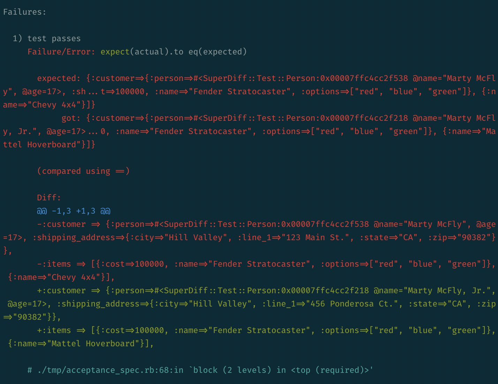
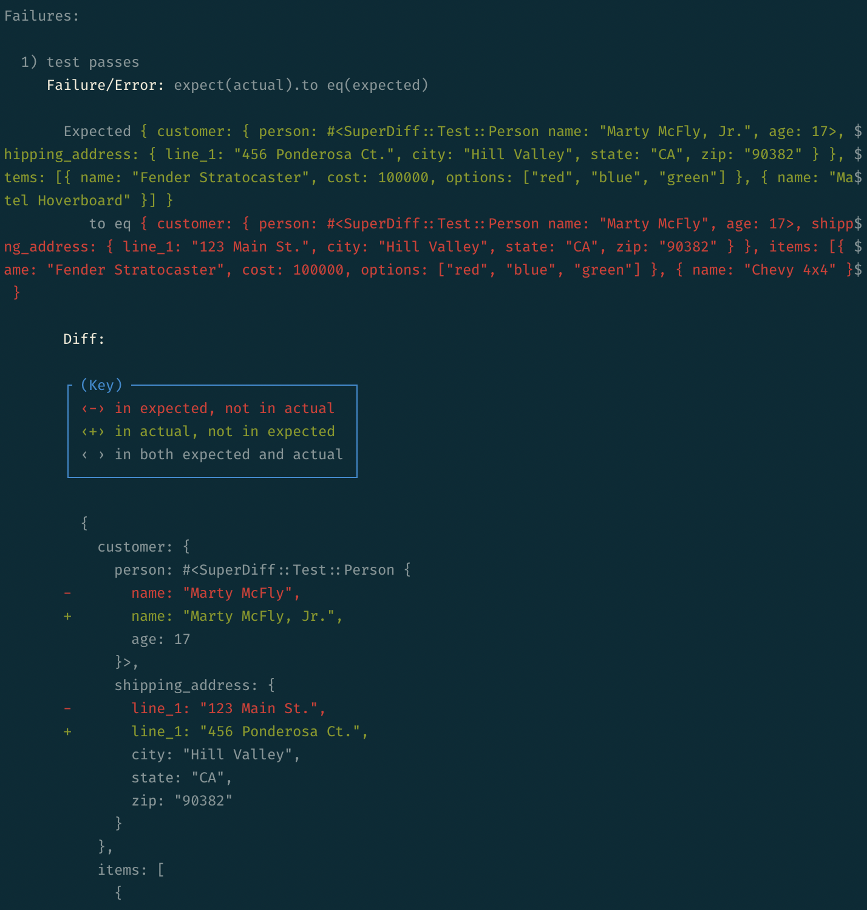

# SuperDiff [![Gem Version][version-badge]][rubygems] [![Build Status][travis-badge]][travis] ![Downloads][downloads-badge] [![Hound][hound-badge]][hound]

[version-badge]: http://img.shields.io/gem/v/super_diff.svg
[rubygems]: http://rubygems.org/gems/super_diff
[travis-badge]: http://img.shields.io/travis/mcmire/super_diff/master.svg
[downloads-badge]: http://img.shields.io/gem/dtv/super_diff.svg
[hound-badge]: https://img.shields.io/badge/Reviewed_by-Hound-8E64B0.svg
[hound]: https://houndci.com

SuperDiff is a tool that displays the differences between two data structures of
any type in Ruby.

## Introduction

The primary motivation behind this gem is to replace RSpec's built-in diffing
capabilities. Sometimes, whenever you use a matcher such as `eq`, `match`,
`include`, or `have_attributes`, you will get a diff of the two data structures
you are trying to match against. This is really helpful for strings, but not so
helpful for other, more "real world" kinds of values, such as arrays, hashes,
and full-scale objects. The reason this doesn't work is because [RSpec will
naively run your `expected` and `actual` values through Ruby's PrettyPrinter
library][rspec-differ-fail] and then perform a diff of these strings.

For instance, let's say you wanted to compare these two hashes:

``` ruby
actual = {
  customer: {
    person: SuperDiff::Test::Person.new(name: "Marty McFly, Jr.", age: 17),
    shipping_address: {
      line_1: "456 Ponderosa Ct.",
      city: "Hill Valley",
      state: "CA",
      zip: "90382"
    }
  },
  items: [
    {
      name: "Fender Stratocaster",
      cost: 100_000,
      options: ["red", "blue", "green"]
    },
    { name: "Mattel Hoverboard" }
  ]
}

expected = {
  customer: {
    person: SuperDiff::Test::Person.new(name: "Marty McFly", age: 17),
    shipping_address: {
      line_1: "123 Main St.",
      city: "Hill Valley",
      state: "CA",
      zip: "90382"
    }
  },
  items: [
    {
      name: "Fender Stratocaster",
      cost: 100_000,
      options: ["red", "blue", "green"]
    },
    { name: "Chevy 4x4" }
  ]
}
```

If, somewhere in a test, you were to say:

``` ruby
expect(actual).to eq(expected)
```

You would get output that looks like:



Not great.

This library provides a sophisticated set of comparators that know how to
intelligent compute the differences between two data structures and display them
in a way that makes sense. Using the example above, you'd get this instead:



[rspec-differ-fail]: https://github.com/rspec/rspec-support/blob/c69a231d7369dd165ad7ce4742e1a2e21e3462b5/lib/rspec/support/differ.rb#L178

## Installation

Want to try out this gem for yourself? As with most development-related gems,
there are a couple ways depending on your type of project:

### Rails apps

If you're developing a Rails app, add the following to your Gemfile:

``` ruby
gem "super_diff"
```

After running `bundle install`, add the following to your `rails_helper`:

``` ruby
require "super_diff/rspec-rails"
```

You're done!

### Libraries

If you're developing a library, add the following to your gemspec:

``` ruby
spec.add_development_dependency "super_diff"
```

Now add the following to your `spec_helper`:

``` ruby
require "super_diff/rspec"
```

You're done!

## Configuration

As capable as this library is, it doesn't know how to deal with every kind of
object out there. You might find it necessary to instruct the gem on how to diff
your object. To do this, you can use a configuration block. Simply add this to
your test helper file (either `rails_helper` or `spec_helper`):

``` ruby
SuperDiff::RSpec.configure do |config|
  config.extra_differ_classes << YourDiffer
  config.extra_operational_sequencer_classes << YourOperationalSequencer
  config.extra_diff_formatter_classes << YourDiffFormatter
end
```

*(More info here in the future on adding a custom differ, operational sequencer,
and diff formatter. Also explanations on what these are.)*

## Contributing

If you encounter a bug or have an idea for how this could be better, feel free
to create an issue.

If you'd like to submit a PR instead, here's how to get started. First, fork
this repo and then run:

```
bundle install
```

This will install dependencies. From here you can run all of the tests:

```
bundle exec rake
```

Or a single test:

```
bundle exec rspec spec/acceptance/...
bundle exec rspec spec/unit/...
```

Finally, submit your PR and I'll take a look at it when I get a chance.

## Compatibility

`super_diff` is [tested][travis] to work with RSpec 3.x, Ruby >= 2.4.x, and
JRuby >= 9.2.x.

[travis]: http://travis-ci.org/mcmire/super_diff

## Copyright/License

© 2018-2019 Elliot Winkler, released under the [MIT license](LICENSE).
