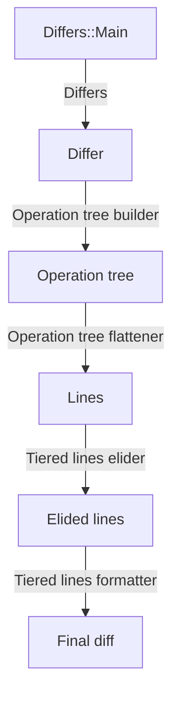

# How SuperDiff works

## SuperDiff's cast of characters

- An **inspection tree builder** (or, casually, an _inspector_)
  makes use of an **inspection tree**
  to generate a multi-line textual representation of an object,
  similar to PrettyPrinter in Ruby or AwesomePrint,
  but more appropriate for showing within a diff.
- An **operation tree builder** makes a comparison between two objects
  (the "expected" vs. the "actual")
  and generates an **operation tree** to represent the differences.
- An operation tree is made up of **operations**,
  which designate differences in the inner parts of the two objects.
  Those differences can be of type _delete_, _insert_, or _change_.
  Since objects can be nested,
  some operations can have children operations themselves,
  hence the tree.
- An **operation tree flattener** takes an operation tree
  and converts them to a set of **lines**,
  which will aid in generating a diff.
  Logic is applied to determine whether to place prefixes, suffixes, or commas.
  Each operation may in fact generate more than one line
  because the object that is specific to the operation is run through an inspector.
- A **diff formatter** takes a set of lines
  and spits out a textual representation in the form of a conventional diff.
- A **differ** ties everything together
  by figuring out which operation tree builder to use for a pair of expected and actual values,
  building an operation tree,
  and then converting it to a diff.

## Where SuperDiff integrates into RSpec

As described in ["How RSpec works"](./how-rspec-works.md#what-rspec-does),
when an assertion in a test fails —
which happens when a matcher whose `matches?` method returns `false`
is passed to `expect(...).to`,
or when a matcher whose `does_not_match?` method returns `true`
is passed to `expect(...).not_to` —
RSpec will call the `RSpec::Expectations::ExpectationHelper#handle_failure` method,
which will call `RSpec::Expectations.fail_with`.
This method will use `RSpec::Matchers::ExpectedsForMultipleDiffs`
and the differ object that `RSpec::Expectations.differ` returns
to generate a diff,
combining it with the failure message from the matcher,
obtained by either calling `failure_message` or `failure_messsage_when_negated`,
and then it will bundle them both into an error object.
RSpec's runner will eventually capture this error and hand it to the reporter,
which will display it via `RSpec::Core::Formatters::ExceptionPresenter`.

Given this, there are a few things that SuperDiff needs to do
in order to integrate fully with RSpec.

1. First,
   SuperDiff needs to get RSpec to use its differ instead of its own.
   Unfortunately, while RSpec is very configurable,
   it does not allow its differ to be substituted,
   so the gem needs to do some amount of patching in order to achieve this.
2. Second,
   the gem needs to provide intelligent diffing
   for all kinds of built-in matchers.
   Many matchers in RSpec are marked as non-diffable —
   their `diffable?` method returns `false` —
   causing RSpec to not show a diff after the matcher's failure message
   in the failure output.
   The `contain_exactly` matcher is one such example.
   SuperDiff turns this on —
   but the only way to do this is via patching.
3. Lastly,
   SuperDiff also modifies the failure messages for RSpec's built-in matchers
   so that key words belonging to the "expected" and "actual" values
   get recolored.
   Again, the only real way to do this is via patching.

Here are all of the places that SuperDiff patches RSpec:

- `RSpec::Expectations.differ`
  (to use `SuperDiff::RSpec::Differ` instead of RSpec's own differ)
- `RSpec::Expectations::ExpectationHelper#handle_failure`
  (to consult the matcher for the "expected" and "actual" values,
  under special methods `expected_for_diff` and `actual_for_diff`)
- `RSpec::Core::Formatters::ConsoleCodes`
  (to allow for using SuperDiff's colors
  and to remove the fallback in the absence of a specified color)
- `RSpec::Core::Formatters::ExceptionPresenter`
  (to recolor failure output)
- `RSpec::Core::SyntaxHighlighter`
  (to turn off syntax highlighting for code,
  as it interferes with the previous patches)
- `RSpec::Support::ObjectFormatter`
  (to use SuperDiff's object inspectors)
- `RSpec::Matchers::ExpectedsForMultipleDiffs`
  (to add a key above the diff,
  add spacing around the diff,
  and colorize the word "Diff:")
- `RSpec::Matchers::Builtin::*`
  (to reword failure messages across various matchers)
- `RSpec::Matchers`
  (to reset the `an_array_matching` alias for `match_array`,
  and to ensure that `match_array` preserves behavior,
  as it is backed by MatchArray class specific to SuperDiff)

## How SuperDiff's diff engine works

With the internals of RSpec thoroughly explored,
the internals of SuperDiff can finally be enumerated.

Once a test fails
and RSpec delegates to SuperDiff's differ,
this sequence of events occurs:

1. `SuperDiff::Differs::Main.call` is called with a pair of values: `expected` and `actual`.
   This method looks for a differ that is suitable for the pair
   among a set of defaults and the list of differs registered via SuperDiff's configuration.
   It does this by calling `.applies_to?` on each,
   passing the `expected` and `actual`;
   the first differ for whom this method returns `true` wins.
   (This is a common pattern throughout the codebase.)
   In most cases, if no differs are suitable,
   then an error is raised,
   although this is sometimes overridden.
1. Once a differ is found,
   its `.call` method is called.
   Since all differs inherit from `SuperDiff::Differs::Base`,
   `.call` always builds an operation tree,
   but the type of operation tree to build
   — or, more specifically, the operation tree builder subclass —
   is determined by the differ itself,
   via the `operation_tree_builder_class` method.
   For instance,
   `SuperDiff::Differs::Array` uses a `SuperDiff::OperationTreeBuilder::Array`,
   `SuperDiff::Differs::Hash` uses a `SuperDiff::OperationTreeBuilder::Hash`,
   etc.
1. Once the differ has an operation tree builder,
   the differ calls `.call` on it
   to build an operation tree.
   Different operation tree builders do different things
   depending on the types of objects,
   but the end goal is to iterate over both the expected and actual values in tandem,
   find the differences between them,
   and represent those differences as operations.
   An operation may be one of four types:
   `insert`, `delete`, `change`, or `noop`.
   In the case of collections —
   which covers most types of values —
   the diff is performed recursively.
   This means that just as collections can have multiple levels,
   so too can operation trees.
1. Once the differ has an operation tree,
   it then calls `to_diff` on it.
   This method is defined in `SuperDiff::OperationTrees::Base`,
   and it starts by first flattening the tree.
1. This means that we need an operation tree flattener class.
   Like differs,
   operation trees specify which operation tree flattener they want to use
   via the `operation_tree_flattener_class` method.
1. Once the operation tree has a flattener class,
   it calls `.call` on the class
   to flatten the tree.
1. Different types of flatteners also do different things,
   but most of them operate on collection-based operation trees.
   Since operation trees can have multiple level,
   the flattening must be performed recursively.
   The end result is a list of Line objects.
1. Once the operation tree has been flattened,
   then if the user has configured the gem to do so,
   a step is performed to look for unchanged lines
   (that is, operations of type `noop`)
   and _elide_ them —
   collapse them in such a way that the surrounding context is still visible.
1. Once a set of elided lines is obtained,
   the operation tree runs them through a formatter —
   so called `TieredLinesFormatter` —
   which will add the `-`s and `+`s along with splashes of color
   to create the final format you see at the very end.

In summary:

