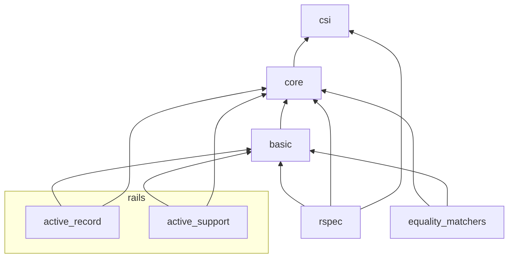

# Structure

To help you in your contributing journey,
this page offers insight into how the SuperDiff codebase is laid out.

Note that this page does not mention every single file:
some files which are unimportant,
such as those which only serve to require other files,
have been omitted.

## Implementation files

All implementation files in the project are located in `lib/`,
and most are located in `lib/super_diff/`.

In `lib/super_diff` there are 7 notable directories,
which create 4 layers:

Following is a breakdown of each directory.

### Top level (`lib/`)

- **`super_diff.rb`:**
  In addition to loading the whole library,
  this file contains helpers which are so useful that they can be called anywhere.

### `SuperDiff::Core` (`lib/super_diff/core/`)

The Core module provides building blocks, utilities, and other primitives
that are used throughout the library.

This directory can be grouped into the following themes:

#### Initialization

- **`configuration.rb`:**
  Stores settings for SuperDiff
  which can be used to control the behavior of various features.

#### Differ

- **`abstract_differ.rb`:**
  The superclass for all differ classes.
- **`differ_dispatcher.rb`:**
  Finds the differ class that best matches a combination of "expected" and "actual" values,
  then uses it to run the diff between them.
- **`no_differ_available_error.rb`:**
  The error produced when the DifferDispatcher fails to find a matching class.

#### Operation tree

- **`abstract_operation_tree_builder.rb`:**
  The superclass for all operation tree builder classes,
  defined elsewhere in SuperDiff or by users.
- **`abstract_operation_tree.rb`:**
  The superclass for all operation tree classes,
  defined elsewhere in SuperDiff or by users.
- **`abstract_operation_tree_flattener.rb`:**
  The superclass for all operation tree flattener classes,
  defined elsewhere in SuperDiff or by users.
- **`binary_operation.rb`:**
  A node in an operation tree which represents a comparison between two values.
- **`no_operation_tree_available_error.rb`:**
  The error produced when the OperationTreeFinder fails to find a matching class.
- **`no_operation_tree_builder_available_error.rb`:**
  The error produced when the OperationTreeBuilderDispatcher fails to find a matching class.
- **`operation_tree_builder_dispatcher.rb`:**
  Finds the operation tree builder class
  that best matches a combination of "expected" and "actual" values,
  then uses it to build the operation tree representing the difference between them.
- **`operation_tree_finder.rb`:**
  Finds the operation tree matching a value.
- **`unary_operation.rb`:**
  A node in an operation tree which represents an operation to a value.

#### Lines

- **`line.rb`:**
  A deconstructed, mutable version of a line in the final diff output.
- **`tiered_lines_elider.rb`:**
  Collapses unchanged sections of a diff,
  represented by lines which are indented hierarchically.
- **`tiered_lines_formatter.rb`:**
  Takes a collection of diff line objects and produces a diff string.

#### Object inspection

- **`inspection_tree_nodes/`:**
  Classes which represent directives that can be given
  when constructing an inspection tree.
  Different directives format the resulting text different ways
  or even hide text if it does not match a certain condition.
- **`abstract_inspection_tree_builder.rb`:**
  The superclass for all inspection tree builder classes,
  defined elsewhere in SuperDiff or by users.
- **`inspection_tree.rb`:**
  A domain-specific language used to format the contents of an object.
  The result can either be a single-line string,
  useful for descriptions and failure messages,
  or a series of Line objects,
  useful for inserting into diffs.
- **`inspection_tree_builder_dispatcher.rb`:**
  Finds the inspection tree builder class that best matches a value,
  then uses it to build the inspection tree.
- **`no_inspection_tree_builder_available_error.rb`:**
  The error produced when the InspectionTreeBuilderDispatcher fails to find a matching class.
- **`prefix_for_next_inspection_tree_node.rb`:**
  A special token used to represent
  the result of the prefix passed to the `as_prefix_when_rendering_to_lines` directive.
  This prefix needs to be handled specially in the inspection tree rendering logic.
- **`prelude_for_next_inspection_tree_node.rb`:**
  A special token used to represent
  the result of the prelude passed to the `as_prelude_when_rendering_to_lines` directive.
  This prelude needs to be handled specially in the inspection tree rendering logic.
- **`tiered_lines.rb`:**
  Represents the final output of an inspection tree,
  broken up by lines which are indented hierarchically.

#### Utilities

- **`colorized_document_extensions.rb`:**
  Extends the ColorizedDocument DSL
  so that text can be colored
  using names that are not abstract
  but rather related to SuperDiff concepts.
- **`gem_version.rb`:**
  A wrapper around Gem::Version
  which simplifies the interface
  so that operators can be used to compare versions.
- **`helpers.rb`:**
  Utility methods which can be mixed in various places to do various things.
- **`implementation_checks.rb`:**
  Provides a way to define an unimplemented method.
  Such a method will raise an error when called
  unless it is overridden in a superclass.
- **`recursion_guard.rb`:**
  A set of globally accessible methods
  which is used to track repeated encounters of objects
  as a data structure is descended into
  and prevent cyclical or infinite recursion.

### Feature modules

There are 4 directories in `lib/super_diff/` which are collectively known as _feature modules_.
Using the primitives from the Core module,
they implement building blocks
to instruct SuperDiff on how to diff many kinds of objects.
As such, you may see one or more of the following directories:

- `*/differs/`
- `*/inspection_tree_builders/`
- `*/operation_tree_builders/`
- `*/operation_tree_flatteners/`
- `*/operation_trees/`

With that in mind, here is a list of feature modules.

#### `SuperDiff::Basic` (`lib/super_diff/basic`)

This module is so named
because it provides functionality that begins to make SuperDiff useful for users
by adding support for objects that are built into Ruby.

#### `SuperDiff::ActiveSupport` (`lib/super_diff/active_support`)

This module makes use of the building blocks in the Basic module
to instruct SuperDiff how to diff ActiveSupport-specific objects,
such as HashWithIndifferentAccess.

#### `SuperDiff::ActiveRecord` (`lib/super_diff/active_record`)

This module makes use of the building blocks in the Basic module
to instruct SuperDiff how to diff ActiveRecord-specific objects,
such as models and relation objects.

#### `SuperDiff::RSpec` (`lib/super_diff/rspec`)

This module is the largest one
and makes use of the building blocks defined by the Basic module
to provide support for expectation and argument matchers in diffs.
It also patches sections of RSpec to replace its differ with SuperDiff's
and to change failure messages so that they fit better with SuperDiff's philosophy.

There are a few files and directories of note here:

- **`matcher_text_builders/`:**
  These classes are used to craft descriptions and failure messages for RSpec matchers.
- **`differ.rb`:**
  This class stands in for RSpec::Differ
  and conditionally diffs an expected and actual value
  that has been passed to a matcher.
- **`matcher_text_template.rb`:**
  This class is used by matcher text builders
  to progressively build up a string by concatenating tokens together.
  It is similar to an inspection tree
  in that some parts of the string can be rendered differently
  depending on whether we've chosen to display the message
  in a single line or across multiple lines.
  Some tokens can also be colored differently as well.
- **`monkey_patches.rb`:**
  The metaphorical skeleton closet,
  this file does the dirty and outright sinful work
  of overriding various private APIs of the whole RSpec suite of gems
  in order to integrate SuperDiff fully into the test framework.

### Equality matchers (`lib/super_diff/equality_matchers/`)

This directory offers a way to try out SuperDiff
without integrating it into a test framework.
The classes here are merely thin wrappers around building blocks in the Basic module.

### CSI (`lib/super_diff/csi/`)

This directory contains a small library, private to the codebase,
which provides a DSL for colorizing text in the running terminal emulator
with the use of CSI escape sequences.

## Tests

Tests are located in `spec/`.
They are divided into two kinds:

- **Unit tests**, located in `spec/unit/`,
  holds tests for individual classes and methods.
- **Integration tests**, located in `spec/integration/`,
  construct tiny test suites which import SuperDiff
  and run them in isolated environments
  to ensure that SuperDiff works as designed
  in more real-world scenarios.

The files in `spec/support/` (imported via `spec_helper.rb`)
contain helpers, matchers, and tests
that are shared among unit and integration tests,
at their respective levels.

Beyond this, [Zeus][zeus], a way to speed up integration tests,
and is run and configured via these files:

- `bin/start-dev`
- `config/zeus_plan.rb`
- `support/test_plan.rb`
- `zeus.json`

The [official Zeus docs](https://github.com/burke/zeus/blob/master/docs/ruby/modifying.md)
is helpful for understanding how these files work together.

[zeus]: https://github.com/burke/zeus

## Ruby

The following files are used to set up Ruby,
specify dependencies and gem publishing settings,
and run tasks:

- **`.ruby-version`:**
  Specifies the Ruby version required for development.
  Used by tools like `rbenv` and `asdf.`
- **`bin/setup`:**
  Ensures that Ruby, Node, Python, and anything else necessary for development
  is installed on your machine.
- **`gemfiles/`:**
  Holds generated gemspecs and lockfiles for appraisals.
- **`lib/super_diff/version.rb`:**
  Holds the current version of the gem,
  which is used by the gemspec.
  Updating the constant in this file changes the published version.
- **`spec/support/current_bundle.rb`:**
  A support file used by common tasks
  which tracks the currently set appraisal or sets a default.
- **`Appraisals`:**
  Specifies different gemfiles for different testing environments.
- **`Gemfile`:**
  Specifies common development dependencies.
- **`Rakefile`:**
  Contains tasks for running tests and publishing the gem.
- **`super_diff.gemspec`:**
  Standard configuration file for the gem,
  containing the name, description, and production dependencies.

## Linting

The following files are used for linting and formatting the codebase:

- **`.husky/`:**
  Contains Git hooks which are installed via `husky install`.
- **`.yarn/`:**
  Holds the executable and plugins for [Yarn][yarn],
  a package manager for JavaScript.
- **`.prettierignore`:**
  Excludes files from being formatted with [Prettier][prettier].
- **`.prettierrc.json`:**
  Configures Prettier.
- **`.nvmrc`:**
  Specifies the Node version required to run Prettier.
  Used by tools like NVM and `asdf`.
- **`.yarnrc.yml`:**
  Configures Yarn.
- **`package.json`:**
  Specifies JavaScript dependencies needed to run Prettier.

[prettier]: https://prettier.io/
[yarn]: https://yarnpkg.com/

## Documentation

The following files are used for documentation purposes:

- **`docs/`:**
  Contains the documentation that you're reading now!
- **`docs-support/`:**
  Other files which are used for documentation purposes,
  but are not included in any Markdown files.
  Currently only used to generate the screenshots in the README.
- **`.python-version`:**
  Specifies the Python version to use for documentation generation.
  Used by tools like `pyenv` and `asdf`.
- **`mkdocs.yml`:**
  The configuration file for [Mkdocs][mkdocs],
  which reads the Markdown files in `docs/` and generates an HTML version.
- **`pyproject.toml`:**
  Specifies Python dependencies needed to run Mkdocs.
- **`README.md`:**
  The "front of house" for this repository;
  summarizes the project's purpose and goals and how to use it.
- **`CHANGELOG.md`:**
  Describes the changes that appeared in each release over time.
- **`LICENSE`:**
  The full text of the license granted to users of this gem.

[mkdocs]: https://www.mkdocs.org/

## CI

The following files are used for CI and other automated tasks on GitHub:

- **`.github/workflows/`:**
  Describes tasks to run on GitHub when events occur,
  such as automatically running tests on pull requests.
- **`scripts/collect-release-info.rb`:**
  A script which is used in one of the GitHub workflows
  to determine whether a commit refers to a new release
  and, if so, determine the release version.

## Miscellaneous

These files don't belong in a particular category:

- **`.editorconfig`:**
  Keeps basic editor-specific configuration,
  such as how many spaces to use, line length, etc.
- **`.gitattributes`:**
  Used by Git and GitHub
  to configure presentation of certain types of files in diffs.
- **`.gitignore`:**
  Specifies files that shouldn't show up in the repository.
